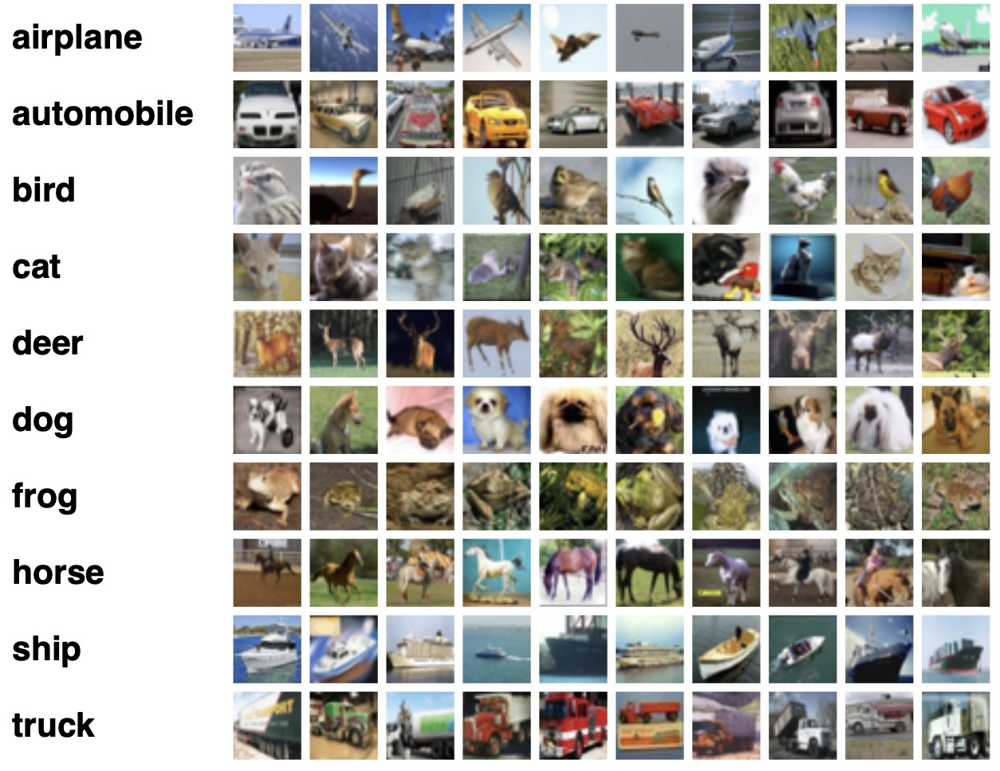
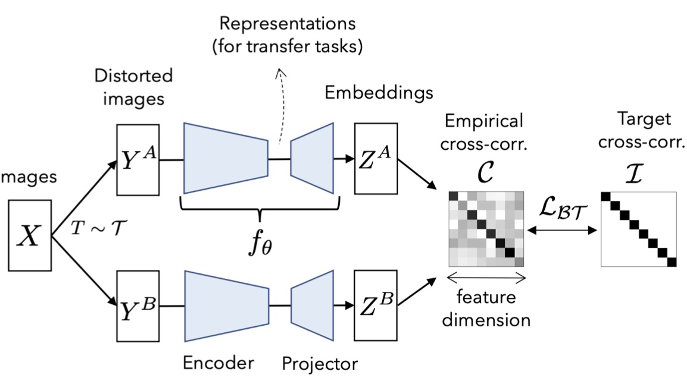

# SELF-SUPERVISED LEARNING - AML HOMEWORK 2022-2

In this homework, you will be evaluating a state-of-the-art Self-supervised learning method.

### Part 1: Barlow Twins in CIFAR-10 (2 points)

In this section, you will implement a k-Nearest Neighbor classifier for CIFAR-10 using self-supervised representations of the Barlow Twins approach.

1. Recall the Barlow Twins approach that we explained in class. For more information, read the Barlow Twins paper: [Barlow Twins: Self-Supervised Learning via Redundancy Reduction](https://arxiv.org/pdf/2103.03230.pdf). The code in `barlowtwins` folder is a modified version of https://github.com/IgorSusmelj/barlowtwins
2. Create a virtual environment and install all the required dependencies. 
`pip install -r requirements.txt`.
3. Run a k-Nearest Neighbors (k-NN) classifier that directly uses the image pixels as features and compute the classification accuracy. Note that the full size of the CIFAR-10 training set is 50000 images, so the k-NN classifiers you should use in this exercise should use about **2%-10% of the available labels in the dataset**. (see `barlowtwins/run_knn.py`)
    - Run experiments with 3 different proportions of available labels. (Include the results in your report) 
4. Now, you are going to learn self-supervised representations for the CIFAR-10 images, without any of the training labels and then, use the encoder for feature extraction. This will be the input for the k-NN classifier. (see `barlowtwins/main.py`)
    - Compare the classification accuracy with those of point **3** and analyze the results. (Include the results in your report) 

- FYI: Time per epoch is around 60 seconds on a Quadro RTX 8000 GPU

### Part 2: Data Augmentation Experiments (1 Point)
1. Barlow Twins is a contrastive learning approach that requires several types of **data augmentation**. Experiment with at least 3 different combinations of transformations and describe the effect of these on accuracy. (Hint: See the documentation for `lightly.data.SimCLRCollateFunction` : https://docs.lightly.ai/lightly.data.html )- Include your results in your report

### Part 3: Hyperparameters Experiments (1 Point)
1. Perform three experiments varying the hyperparameters of your choice. (Include the results in your report
2. Explain why you chose those hyperparameters and conclude wether the results are expected or not

### Part 4: Theorical questions (1 Point)
1. What is the problem with the InfoNCE loss function in practice, which leads to the need for negative
examples during training? How does the non-contrastive learning methods (SimSiam, Barlow Twins) tackle this issue? 
2. A key problem in designing pretext tasks for self-supervised learning is the tendency of the network
to prioritize trivial shortcuts over meaningful learning. Describe some alternatives to avoid this trivial shortcuts in the relative patch prediction task.  
3. Explain how are self supervised learning methods evaluated. What are the limitations on the evaluation method? **(BONUS +0.1)**

### Report 
Please upload to your repository a PDF report lastname_SSL.pdf with the answers of each section.
Thank you and hope you enjoy the tutorial!
**Deadline: Oct 4, 2022, 00:00**
###
